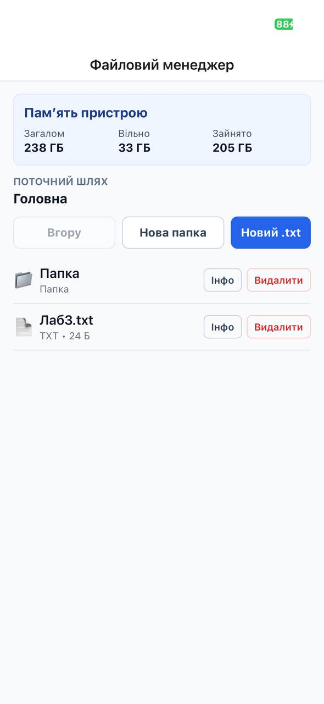
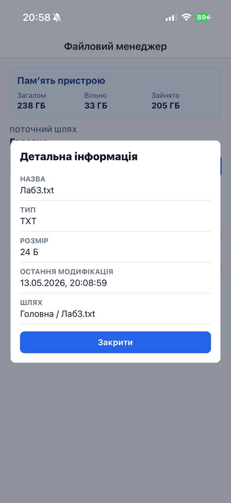

# Файловий менеджер

Мобільний застосунок на React Native та Expo для роботи з локальною файловою системою застосунку.

## Запуск проєкту

1. Перейти в папку проєкту:

   ```bash
   cd lab4
   ```

2. Встановити залежності:

   ```bash
   npm install
   ```

3. Запустити Expo:

   ```bash
   npx expo start
   ```

4. Відкрити застосунок:

   - у Expo Go через QR-код;
   - в iOS Simulator;
   - в Android Emulator.

Якщо після змін відображається стара версія застосунку, запустіть Metro з очищенням кешу:

```bash
npx expo start -c
```

## Реалізований функціонал

- Відображення поточного шляху у вигляді breadcrumb.
- Перегляд вмісту поточної директорії за допомогою `FlatList`.
- Відокремлення папок від файлів у списку.
- Перехід у вкладені папки.
- Перехід до батьківської директорії кнопкою `Вгору`.
- Створення нової папки з введеною назвою.
- Створення нового `.txt` файлу з введеною назвою та початковим вмістом.
- Відкриття `.txt` файлів для перегляду.
- Редагування текстових файлів і збереження змін.
- Видалення файлів і папок із підтвердженням.
- Перегляд детальної інформації про об'єкт файлової системи:
  - назва;
  - тип;
  - розмір;
  - дата останньої модифікації;
  - шлях.
- Відображення статистики памʼяті пристрою на головному екрані:
  - загальний обсяг;
  - вільний простір;
  - зайнятий простір.

## Скріншоти

Скріншоти роботи застосунку збережені в папці `screenshots`.

### Головний екран



### Створення текстового файлу


### Створення папки


### Перехід у вкладену папку


### Детальна інформація про файл


